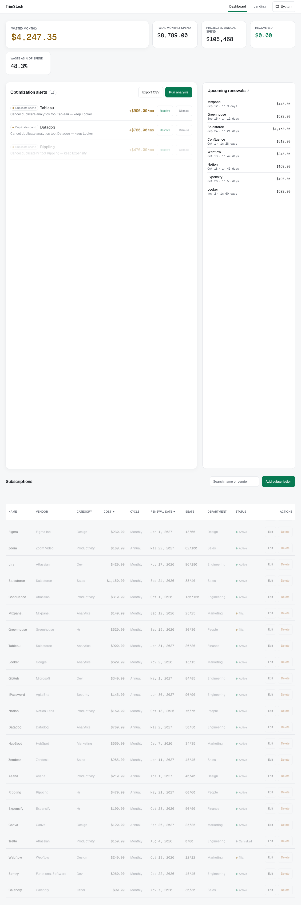
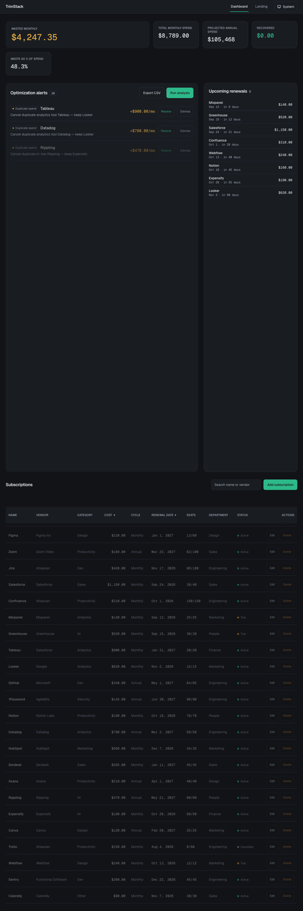
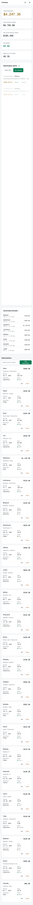
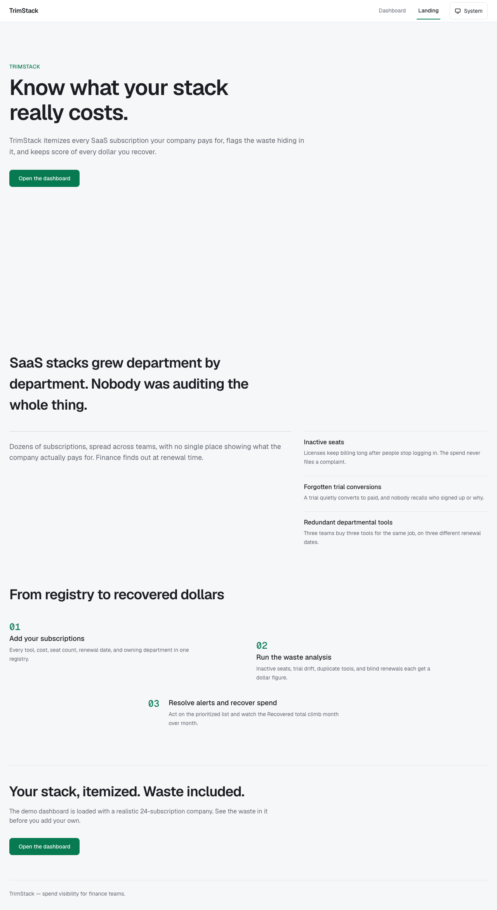
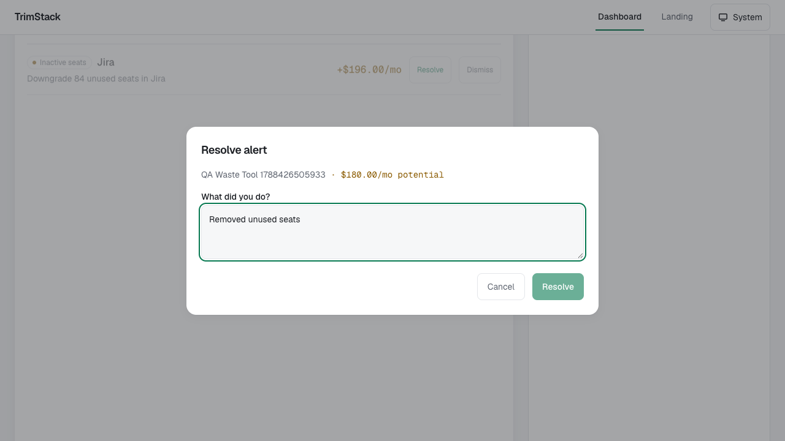

# TrimStack

**SaaS spend visibility for finance teams.** A subscription registry, a waste-detection engine, and a recovery loop — built as a 3-week MVP (NEXUS-Sprint) from an itch-scored problem: *how can companies eliminate unused SaaS subscriptions efficiently?* (itch 83.4 — severity 9, TAM 90, whitespace 8, frequency 9)

**Live hosted demo:** https://hasanabbassorathiya.github.io/trimstack/ — a read-only snapshot of the seeded 24-subscription demo company ($8,789/mo spend, $4,247.35/mo flagged waste, 48.3%). Resolve alerts and export CSV work in the browser; editing is local-only.

## The product



Finance teams at 50–500 person companies accumulate SaaS subscriptions across departments with no central view. TrimStack itemizes every subscription, then flags four waste patterns with dollar figures:

| Flag | Detection | Savings figure |
|---|---|---|
| **Inactive seats** | provisioned > active (last 30 days) | cost × unused fraction |
| **Upcoming renewal** | renewal within 30 days | risk notice (no $ claim) |
| **Trial drift** | trial auto-converting within 14 days | risk notice |
| **Duplicate spend** | 2+ active tools, same category, different departments | the duplicate's own cost |

Every flag is a **potential saving** until someone acts. Resolve records what was done and moves the **Recovered** metric — the only earned number on the dashboard.

### Core surfaces (F1–F6, all shipped)

- **Subscription registry** — full CRUD, search by name/vendor, sort by cost/renewal date
- **Waste engine** — on-demand analysis, penny-exact math (unit-tested), cancelled subs never flag
- **Optimization alerts** — sorted by savings desc, resolve with action-taken note, dismiss
- **Dashboard** — asymmetric metric strip: Wasted Monthly (hero) + Total Spend, Projected Annual, Recovered, Waste %
- **CSV export** — RFC 4180, UTF-8 BOM + CRLF, opens clean in Excel/Numbers
- **Landing page** — 4 sections, honest claims only (no invented stats)

### Design system

Built on a Stitch-based design system (`project-docs/DESIGN.md`): "financial cockpit with editorial calm" — Geist/Geist Mono typography (mono tabular numerals for every figure), one emerald accent, semantic amber hues for waste/risk, WCAG 2.1 AA-verified palette in both themes, light/dark/system theme with live OS tracking, 40ms stagger cascades, reduced-motion respected, mobile stacked-card tables.

| | | |
|---|---|---|
|  |  |  |
| Dark theme | Mobile (375px) | Landing page |



## Quality gates (all green)

| Gate | Evidence |
|---|---|
| Unit tests | **42 passing** — waste engine penny-exact ($180.17 = 230×47/60, $287.14 = 460×201/322), Zod validation, CRUD, CSV round-trip, demo-mode math parity |
| E2E (Playwright) | **33/33 passing** — dashboard value moment, search/sort, run-analysis, resolve→Recovered, dismiss, CSV download + parse-back, theme persistence + live OS tracking, full journeys, performance |
| Screenshot verification | **32/32 passing** — programmatic checks (dimensions, dark-mode luminance, brand-accent presence) via `scripts/verify-evidence.mjs` |
| Performance | API p95 **6ms** (spec: <200ms); page interactive <3s (spec bound) |
| CI (GitHub Actions) | **Green** — typecheck → lint → test → build on ubuntu; Pages deploy pipeline included |
| Certification | 11/11 checklist rows PASS — GO (2026-09-25 launch) — `project-docs/certification-packet.md` |

## Run it locally

```bash
npm install                # installs server/ + web/ workspaces
npm run dev:server         # API + seeded SQLite (idempotent 24-sub demo company) on :3001
npm run dev:web            # app on http://localhost:5173 (proxies /api)
npm run verify             # full gate: typecheck → lint → test → build
```

QA evidence capture (requires dev servers running):

```bash
./qa-playwright-capture.sh     # E2E + 28 screenshots into qa-screenshots/ + test-results.json
node scripts/verify-evidence.mjs  # programmatic screenshot verification
```

## Architecture

```
trimstack/
├── server/               # Express 5 + TypeScript strict + better-sqlite3 + Zod
│   └── src/
│       ├── engine/       # pure waste engine (injectable today; zero DB imports)
│       ├── db/           # repositories, idempotent seed (24-row catalog, relative dates)
│       ├── routes/       # 12 endpoints, JSON error envelope { error: { message, details? } }
│       ├── export/       # RFC 4180 serializer + BOM
│       └── validation/   # Zod schemas incl. cross-field seats rule
├── web/                  # React 19 + Vite + Tailwind v4 (CSS-first, no UI libs)
│   └── src/
│       ├── api/          # typed client + staticDemo facade (GitHub Pages mode)
│       ├── components/   # hand-built, focus-trap modals, aria-sort tables
│       ├── hooks/        # useTheme, useDashboardData, useAlerts, useSubscriptions
│       └── pages/        # Dashboard, Landing
├── e2e/                  # 8 Playwright spec files (4 viewport projects)
├── scripts/              # build-demo-data, verify-evidence
└── project-docs/         # spec, DESIGN.md, api-contract, brand, launch plan, certification
```

**Stack decisions** (rationale in `project-specs/`): better-sqlite3 for zero-config local persistence; on-demand analysis over schedulers (spec out-of-scope: no auth, no email, no cron, no integrations — deliberate v1 wedge); a static demo facade instead of a hosted API for GitHub Pages.

## GitHub Pages demo mode

The hosted demo runs the same React app in read-only mode against a build-time snapshot (`web/public/demo/data.json`, generated by `scripts/build-demo-data.mjs` from the seeded database). In-memory resolve/dismiss and client-side CSV export keep the full demo story working without a backend. `VITE_DEMO=1 vite build --mode demo` produces the `/trimstack/`-based bundle; `.github/workflows/deploy-pages.yml` seeds a fresh DB on the runner, snapshots it, builds, and deploys.

## Project history (NEXUS-Sprint pipeline)

Built through an 8-phase agency pipeline with evidence gates: kickoff/spec → sprint prioritization (RICE, MoSCoW, cut lines) → architecture (API contract, design system) → build (27 tasks) → QA (4 dev→QA fix rounds) → integration → Reality Check certification → growth planning (brand, launch calendar, 16 content assets, KPI framework). Full docs in `project-docs/` and `project-tasks/`.

## License

MIT
